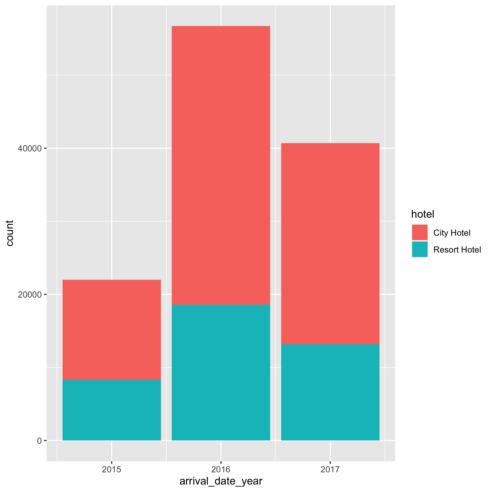
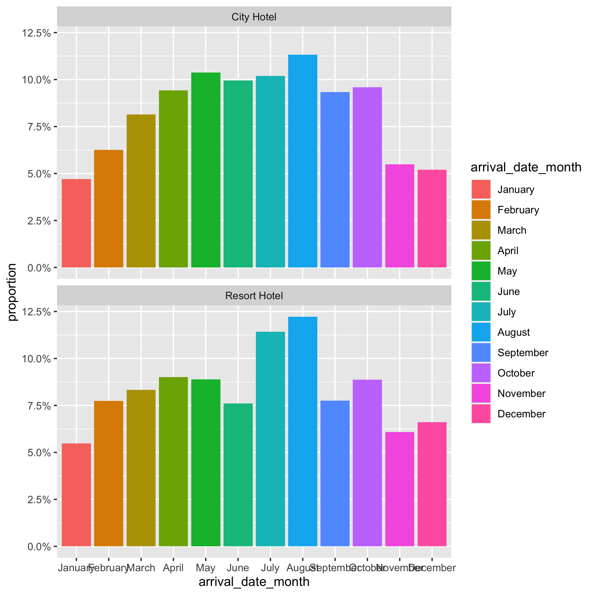

```{r, echo=FALSE}
library(knitr)
```
# Introduction

This project aims on hotel demand data, which is a dataset found on Kaggle and here is its link: https://www.kaggle.com/datasets/jessemostipak/hotel-booking-demand. The dataset contains booking information for a city hotel and a resort hotel and includes information such as when the booking was made, length of stay, the number of adults, children, and the number of available parking spaces, among other things. It has 32 variables and approximately 119000 observations.

In this project, I will do analysis on predicting whether or not a booking is cancelled.


# Data preprocessing and exploratory data analysis
I first examined the presence of missing data and non-standard expression of data. Variables which had more than 10% missing value were deleted. 


Next I did some exploratory data analysis. Here are two plots for the City hotel vs Resort hotel:

```{r, echo=FALSE, fig.align = 'center', out.width = "60%", fig.cap = "city hotel vs resort hotel for different years"}

```


From figure 1, we can see that the cancellation counts of city hotel are greater than resort hotel in all 3 years. 


```{r, echo=FALSE, fig.align = 'center', out.width = "60%", fig.cap = "city hotel vs resort hotel for different month"}

```

From figure 2, we can see that July and August have high proportion of cancellation in both city hotel and resort hotel. 


Since variable "country" had too many categories (more than 100), it's better to delete it. Also, some variables were correlated, for example, "arrival_date_month" and "arrival_date_week_number". It's enough to pick only one of them. Those variables which were not relevant to our aim were also deleted. Finally, we would use 17 variables to do the analysis. 

# Method
I used 2 methods to do the analysis, logistic regression and decision tree.

## 1.Logistic regression
The logistic regression is of the form:
\begin{align*}
p(x)=\frac{1}{1+e^{-\beta X}}
\end{align*}
where $p(x)$ is the probability of cancellation and $\beta$ is the coefficient matrix and $X$ is the covariate matrix.

I randomly selected 70% of the data as training set and the rest 30% of the data as testing set.

From table 1, we can see the main result of the logistic regression. Most of the variables are significant.
\begin{table}[H]
\centering
\begin{tabular}{|l|l|l|l|l|}
\hline
                                  & Estimate   & Std. Error & z value & Pr(\textgreater{}|z|) \\ \hline
Intercept                         & -1.814e+00 & 4.229e-02  & -42.889 & \textless 2e-16       \\ \hline
hotelResort Hotel                 & -1.077e-01 & 2.017e-02  & -5.341  & 9.23e-08              \\ \hline
lead\_time                        & 2.745e-03  & 9.856e-05  & 27.852  & \textless{}2e-16      \\ \hline
arrival\_date\_week\_number       & -5.592e-03 & 6.937e-04  & -8.061  & 7.59e-16              \\ \hline
stays\_in\_weekend\_nights        & 5.348e-02  & 1.022e-02  & 5.233   & 1.67e-07              \\ \hline
stays\_in\_week\_nights           & 4.328e-02  & 5.354e-03  & 8.084   & 6.26e-16              \\ \hline
adults                            & 1.928e-01  & 1.938e-02  & 9.947   & \textless 2e-16       \\ \hline
children                          & 1.873e-01  & 2.165e-02  & 8.649   & \textless 2e-16       \\ \hline
is\_repeated\_guest               & -7.337e-01 & 9.514e-02  & -7.713  & 1.23e-14              \\ \hline
previous\_cancellations           & 2.564e+00  & 7.099e-02  & 36.114  & \textless 2e-16       \\ \hline
previous\_bookings\_not\_canceled & -5.223e-01 & 3.189e-02  & -16.377 & \textless 2e-16       \\ \hline
booking\_changes                  & -4.752e-01 & 1.855e-02  & -25.619 & \textless 2e-16       \\ \hline
deposit\_typeNon Refund           & 5.320e+00  & 1.322e-01  & 40.229  & \textless 2e-16       \\ \hline
deposit\_typeRefundable           & -1.107e-01 & 2.314e-01  & -0.478  & 0.632                 \\ \hline
days\_in\_waiting\_list           & -4.404e-03 & 5.904e-04  & -7.459  & 8.69e-14              \\ \hline
adr                               & 6.555e-03  & 2.125e-04  & 30.847  & \textless 2e-16       \\ \hline
required\_car\_parking\_spaces    & -2.648e+03 & 9.223e+05  & -0.003  & 0.998                 \\ \hline
total\_of\_special\_requests      & -4.601e-01 & 1.237e-02  & -37.202 & \textless 2e-16       \\ \hline
\end{tabular}
\caption{Result of logistic regeression}
\label{tab:my-table}
\end{table}


Table 2 is the confusion matrix of the logistic regression. We can get that the accuracy of this model is 0.7766. The sensitivity is 0.9663 and the specificity is 0.4600. Although the accuracy is not bad in some degree, the false positive rate is too high.

\begin{table}[H]
\centering
\begin{tabular}{llll}
           &   & reference &      \\
           &   & 0         & 1    \\
prediction & 0 & 21644     & 7245 \\
           & 1 & 756       & 6171
\end{tabular}
\caption{Confusion matrix of logistics regression }
\label{tab:my-table}
\end{table}

Table 3 is the variable importance of logistic regression. As shown in table 3, "lead_time", "previous_cancellations", "booking_changes", "deposit_typeNon Refund", "adr" (average daily rate) and "total_of_special_requests" are much more important than other variables. This result is consistent with what I get in the method of decision tree (we will see it later).
```{r,echo=FALSE}
a<-read.csv("./derived_data/varimp.csv")
kable(a,format="latex" , position="H",caption="Variable improtance of logistic regression")
```


## 2. Decision tree
The second method I use is decision tree. As shown in Figure 3, for non-refundable deposit, the predicted result of cancellation is yes. For no deposit and refundable deposit, when the required car parking space is 0, the predicted result of cancellation is not. When the required car parking space is greater or equal to 1, then we need to check leadtime and previous cancellation.

From the deposit, leadtime and previous cancellations aspects I want to give the hotels two recommendations.
The first is manage and hold long leadtime bookings.
Hotel can send email to remind the customers who book the hotel much earlier before check-in and update hotel news with them to make the customers feel that they are valued and strengthen their impression of the hotel.
Also, hotel can give earlier customers cash coupon for the next time booking after they actually check-out from the hotel to increase customer stickiness and decrease cancellation rate.


In terms of deposit and refund policy, hotel can set higher deposit and non-refund policy for last-minute bookings because if they choose to cancel the bookings, the time for the hotel to release vacancy rooms and gain new bookings is too short and the rooms may be wasted.
Set non-refund deposit for customers during peak demanding seasons.
No deposit for loyal customers who didn’t cancel the reservation previously because they may plan their trips in relatively earlier time and keep stickiness and loyalty for the hotel. The probability of canceling the booking is lower for these customers so the hotel may not have loss.
\begin{figure}[H]
  \includegraphics{./figures/decision_tree.png}
  \caption{Decision tree}
\end{figure}


Table 4 is the confusion matrix of decision tree. From this table, we can get that the accuracy of this model is 0.7861. The false positive rate is still very high, which is very similar to that of the logistic regression model.
\begin{table}[H]
\centering
\begin{tabular}{llll}
           &   & actual &      \\
           &   & 0      & 1    \\
prediction & 0 & 21187  & 6449 \\
           & 1 & 1213   & 6967
\end{tabular}
\caption{Confusion matrix of decision tree}
\label{tab:my-table}
\end{table}

# Conclusion
I used logistic regression and decision model to do the analysis. Both of the models have the accuracy greater than 0.75, but the false positive rate is a bit high. Also according to the decision tree model, I give the hotels some recommendations that can decrease the cancellation rate.

# Future work
Next, I plan to deal with the problem of high false positive rate. I will try some neural network methods and other classification methods. 

